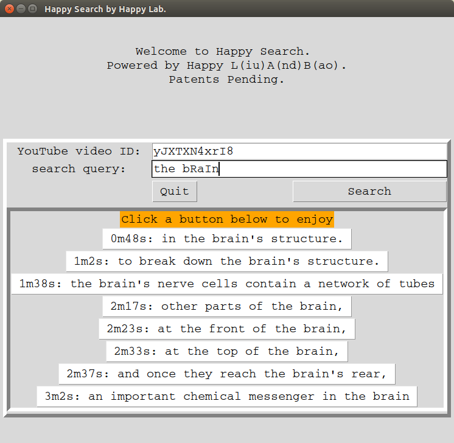

# Happy Search: Search in YouTube video transcripts

Circa 2016, I built this app to search in transcripts of YouTube videos. I was looking for something particular in an event video with a friend. But the video was long and we had to slide through to locate. This was painful. So my friend said why didn't we just search in the transcript? Hence, the app. 

The app was built in Python wrapper for Tcl/Tk. You enter a YouTube video ID and a search term, then temporal locations where matches are found become buttons. Click a button will jump to the corresponding timestamp. 

And we leveraged a feature of YouTube that the transcript, called Timed Text, is at `http://video.google.com/timedtext?lang=en&v={videoID}`. 

This app may not work today any more due to the changes in Python's ecosystem. 
